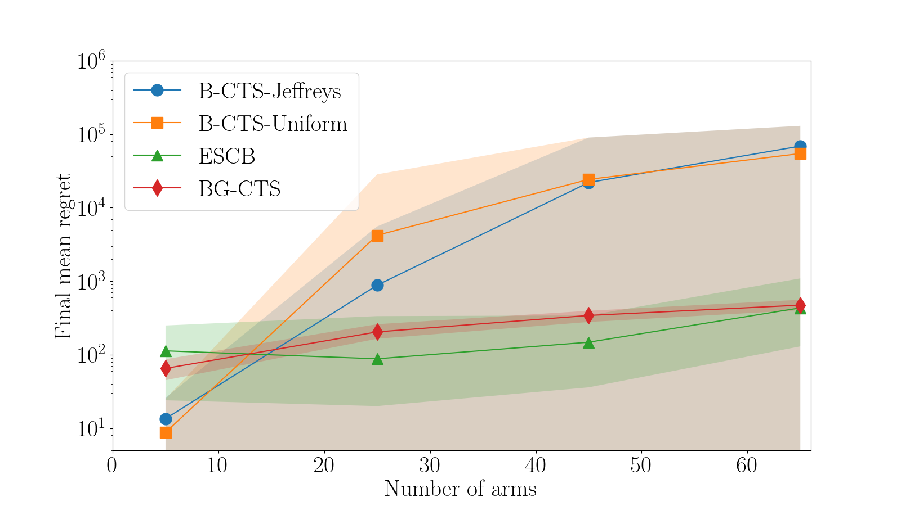

# Thompson Sampling For Combinatorial Bandits: Polynomial Regret and Mismatched Sampling Paradox

This is the code used to generate the experiments and the figures used in our paper "Thompson Sampling For Combinatorial Bandits: Polynomial Regret and Mismatched Sampling Paradox". The paper published in the NeurIPS 2024 Proceedings and is also available at : https://arxiv.org/abs/2410.05441

To generate the experiment run the CTS code notebook in order. Feel free to modifier and play with the parameters. You can also find some experiment on the function $g(t)$ in the Functionstudy notebook.

This notebook python implements a minimal version of CTS Beta, BG-CTS, and ESCB for the Two decision problem.

Here are the comparison of the regret dependence on the number of arms for the three algorithms:

